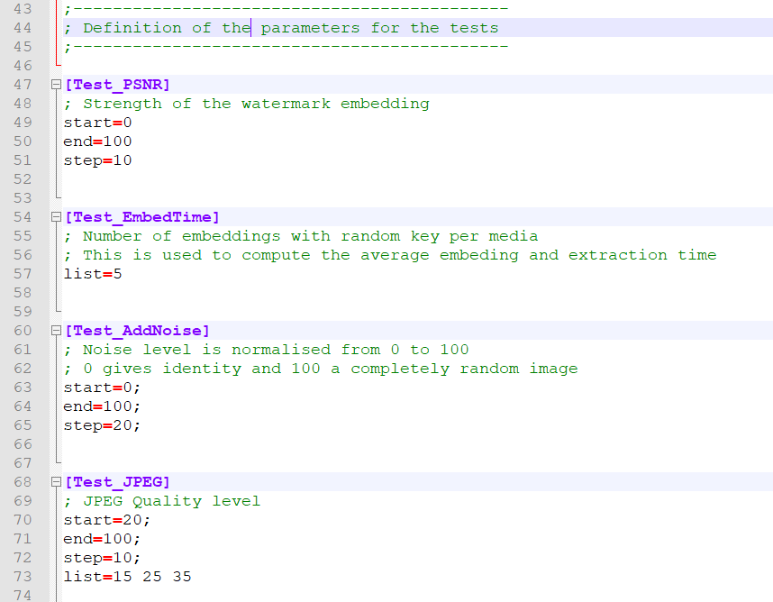

# StirMarkBenchmark图像攻击工具分享

StirMarkBenchmark工具主要用于图像攻击，可用于数字水印攻击测试，常见的包括噪声攻击，压缩攻击，剪切攻击，旋转攻击等等，用Stirmark工具可以很方便的得到这几种攻击后的图。

## 使用方法

#### 图像准备

将需要进行攻击测试的图像放在.\StirMarkBenchmark_4_0_129\Media\Input\Images\Set1目录下，注意，这里只能使用bmp格式的图像，如果有多张需测试的图像也可以放在\Set2或\Set3的目录下，测试样例如下：

#### 参数配置

在.\StirMarkBenchmark_4_0_129\Profiles目录下可以看到SMBsettings.ini配置文件，可以对需要测试的文件目录和进行测试的项目进行测试：

在下方可以对每种攻击方式的参数进行配置：

#### 攻击实现

在.\StirMarkBenchmark_4_0_129\Bin\Benchmark目录下运行StirMark Benchmark.exe程序，运行结果如下：

#### 攻击结果

在.\\StirMarkBenchmark_4_0_129\Media\Output\Images\Set1目录下可以看到相应的攻击结果

